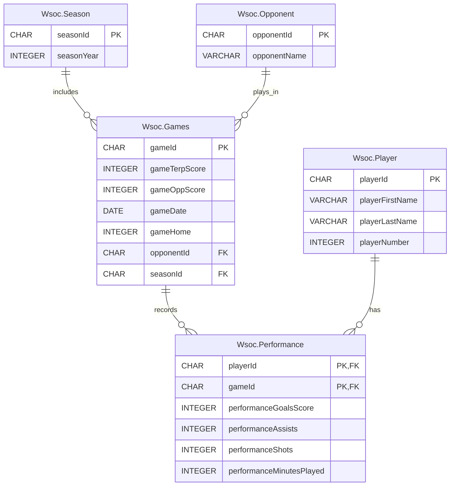

# COVID WSoc Stats

A SQL Server database of University of Maryland Women's Soccer results from the 2019, 2020, and 2021 seasons, built to look at how the team performed before, during, and after the COVID-19 disruption.

## Why these three seasons

The 2020 season was pushed back by the pandemic and played in the spring, from February 20 to April 8, 2021. It was shorter (12 games instead of 20) and almost entirely conference play. The 2019 season gives a normal baseline, and fall 2021 shows what the return to a regular schedule looked like.

| Season | Dates | Games | Record (W-L-T) | Goals For | Goals Against |
|---|---|---|---|---|---|
| 2019 | Aug 22 to Nov 3, 2019 | 20 | 9-8-3 | 25 | 33 |
| 2020 | Feb 20 to Apr 8, 2021 | 12 | 0-10-2 | 8 | 29 |
| 2021 | Aug 19 to Oct 21, 2021 | 17 | 4-8-5 | 18 | 27 |

## Database design



Performance resolves the many-to-many relationship between Player and Game, with one row per player per game they appeared in.

| Table | Rows |
|---|---|
| Wsoc.Player | 41 |
| Wsoc.Opponent | 26 |
| Wsoc.Season | 3 |
| Wsoc.Games | 49 |
| Wsoc.Performance | 838 |

## Data sources

- Season stat sheets for 2019, 2020, and 2021 (in `data/source/`)
- Game-by-game box scores from umterps.com, used to build the Performance table with `scripts/build_performance_inserts.py`

Season totals from the database (goals, assists, shots, records) were checked against the official stat sheets and match. A few player names are spelled differently across the stat sheets (for example "Sefick" and "Sefcik"). These were mapped to one player each so stats aren't split across duplicate rows.

## Findings

### 1. Who were the top-performing players before, during, and after COVID?

Points are calculated as 2 per goal plus 1 per assist, and the query keeps players with at least 5 points in a season.

| Season | Player | Games | Goals | Assists | Shots | Points |
|---|---|---|---|---|---|---|
| 2019 | Alyssa Poarch | 20 | 8 | 3 | 68 | 19 |
| 2019 | Mikayla Dayes | 20 | 5 | 1 | 40 | 11 |
| 2019 | Loren Sefcik | 20 | 3 | 4 | 39 | 10 |
| 2019 | Jlon Flippens | 13 | 0 | 6 | 11 | 6 |
| 2019 | Adalee Broadbent | 20 | 2 | 1 | 14 | 5 |
| 2020 | Alyssa Poarch | 10 | 2 | 1 | 25 | 5 |
| 2020 | Keyera Wynn | 8 | 2 | 1 | 6 | 5 |
| 2020 | Mikayla Dayes | 12 | 2 | 1 | 25 | 5 |
| 2021 | Mikayla Dayes | 17 | 2 | 3 | 45 | 7 |
| 2021 | Loren Sefcik | 17 | 3 | 0 | 28 | 6 |
| 2021 | Alyssa Poarch | 4 | 2 | 2 | 15 | 6 |
| 2021 | Kori Locksley | 14 | 2 | 2 | 18 | 6 |
| 2021 | Emily McNesby | 13 | 2 | 1 | 13 | 5 |

Alyssa Poarch was the clear leader in 2019 with 19 points, almost double the next player. In 2020 nobody scored more than 2 goals, and the top three players finished tied at 5 points. Scoring in 2021 stayed spread out, with five players between 5 and 7 points. Mikayla Dayes is the only player who made the list in all three seasons.

### 2. Which opponents did Maryland have different results against across the seasons?

| Opponent | Seasons | Games | Wins | Losses | Ties |
|---|---|---|---|---|---|
| George Washington | 2 | 2 | 1 | 0 | 1 |
| Illinois | 2 | 2 | 1 | 1 | 0 |
| Indiana | 3 | 3 | 0 | 1 | 2 |
| Michigan State | 3 | 3 | 1 | 1 | 1 |
| Minnesota | 2 | 2 | 1 | 1 | 0 |
| Nebraska | 2 | 2 | 0 | 1 | 1 |
| Northwestern | 2 | 2 | 0 | 1 | 1 |
| Purdue | 2 | 2 | 1 | 1 | 0 |
| Rutgers | 3 | 3 | 1 | 1 | 1 |
| Temple | 2 | 2 | 1 | 0 | 1 |

Ten opponents produced different results in different seasons. Michigan State and Rutgers stand out, since Maryland won, lost, and tied against each of them across the three years. Against Big Ten opponents like Minnesota, Purdue, and Illinois, the 2019 wins turned into losses in later seasons.

### 3. How did goals, assists, shots, and minutes change across the seasons?

| Season | Goals | Assists | Shots | Minutes Played |
|---|---|---|---|---|
| 2019 | 25 | 21 | 263 | 20,660 |
| 2020 | 8 | 6 | 103 | 12,392 |
| 2021 | 18 | 12 | 213 | 17,396 |

Because the seasons had different numbers of games, per-game numbers give a fairer comparison:

| Season | Goals per Game | Shots per Game |
|---|---|---|
| 2019 | 1.25 | 13.2 |
| 2020 | 0.67 | 8.6 |
| 2021 | 1.06 | 12.5 |

Goals per game dropped by about half in 2020 and shots per game fell by about a third. Both recovered in 2021 but stayed below 2019 levels. Total minutes mostly reflect how many games were played, since minutes per game were about the same every season.

### 4. When did Maryland have its highest and lowest-scoring games?

The highest-scoring game was a **6-2 win over Illinois on October 6, 2019**, the only time Maryland scored more than 3 goals in these three seasons.

The lowest score was 0, which happened in 22 of the 49 games:

| Season | Games with 0 Maryland Goals | Share of Games |
|---|---|---|
| 2019 | 8 of 20 | 40% |
| 2020 | 7 of 12 | 58% |
| 2021 | 6 of 17 | 35% |

The 2020 spring season had the highest share of scoreless games, and it included the widest loss of the period, 0-6 at Penn State. By 2021 the share of scoreless games had dropped below the 2019 level.

## Summary

The 2020 season was the low point across almost every measure: no wins, the fewest goals per game, and Maryland was held scoreless in more than half its games. The 2021 season showed a partial recovery in scoring and shots, but the team still had a losing record and didn't return to its 2019 production.

## How to run

The scripts are written for Microsoft SQL Server. Create a database named `BUDT702_Project_0501_01`, then run the files in `sql/` in this order:

1. `BUDT702_Project_0501_01_CREATE.sql` drops and creates the tables
2. `BUDT702_Project_0501_01_INSERT.sql` loads the data
3. `BUDT702_Project_0501_01_SELECT.sql` runs the four business questions

To regenerate the Performance inserts from the box scores:

```
pip install requests beautifulsoup4
python scripts/build_performance_inserts.py
```

## Repository structure

```
covid-wsoc-stats/
├── README.md
├── sql/
│   ├── BUDT702_Project_0501_01_CREATE.sql
│   ├── BUDT702_Project_0501_01_INSERT.sql
│   └── BUDT702_Project_0501_01_SELECT.sql
├── scripts/
│   └── build_performance_inserts.py
└── data/
    └── source/
        ├── 2019_Wsoc_season_stats.pdf
        ├── 2020_Wsoc_season_stats.pdf
        └── 2021_Wsoc_season_stats.pdf
```
